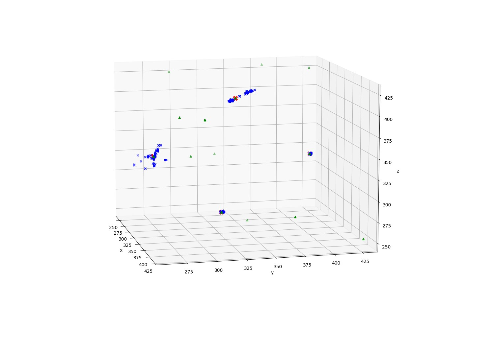
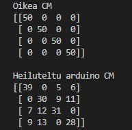

# Tietoliikenteen Sovellusprojekti

Tietoliikenteen sovellusprojekti vuodelle 2022 projektin tarkoituksena on tehdä arduino client joka lähettää kiihtyvyys anturi dataa IoT reitittimelle joka tallentaa datan tietokantaan jossa on TCP-sokettirajapinta ja HTTP API. Tämän jälkeen data haetaan ohjelmalla ja käsitellään koneoppimis algoritmilla joka tunnistaa miten päin arduino client on ollut datan keräys hetkellä.

## Projetin muut tavoitteet
Projektissa on myös tavoitteena opetella ongelmien pilkkomista pienempiin osiin ja niitten ratkaisua ryhmissä. Sekä muutenkin työskentelyä moderneissa tiimi rakenteissa.

### Sisällys

[Arduino Kiihtyvyys datan lähetys](#arduino-kiihtyvyys-datan-lähetys-ja-mittaus)

[Python import csv](#python-import-csv)

[Python import socket](#python-import-socket)

[Python mysql get](#python-mysql-get)

[Python k-means](#python-k-means)

[Arduino k-means](#arduino-k-means)

[Python Confusion Matric](#python-confusion-matrix)

### Arduino kiihtyvyys datan lähetys ja mittaus
Arduino koodi kiihtyvyys datan lähetys ja mittaus mittaa kiihtyvyysdataa sensorilta ja lähettää sen databaseen käyttäen 433MHz lähetintä.

### Python import csv
Python koodi import csv hakee datan databasesta käyttäen TCP request:ia requests kirjaston avulla ja tallentaa datan test.csv nimiseen tiedostoon.

### Python import socket 
python koodi import socket hakee datan databasesta käyttäen socket:tia socket libraryn ja sys libraryn avulla ja tallentaa datan test3.csv nimiseen tiedostoon.

### Python mysql get
Python koodi mysql get hakee datan databasesta käyttäen my sql:n omia komentoja käyttäen kirjastoa mysql.connector ja tallentaa datan test2.csv nimiseen tiedostoon.

### Python K-means
Python k-means koodi ottaa datan joka haettu laskee siitä k-meansia käyttäen neljä keskipistettä ja sitten tekee centerpoints.h nimisen header tiedoston johon se tallentaa keskipisteet myöhempää käyttöä varten.

Kuvassa siniset ristit ovat data pisteitä, vihreat kolmiot arvauksia ja punaiset ristit lopullisia keskipisteitä.

### Arduino K-means
Arduiono koodi K-means mittaa uutta dataa sensorilta ja käyttäen K-means ja aikaisemmin pyhonilla laskettuja keskipisteitä printtaa serialiin miten päin sensori on sillä hetkellä.

### Python Confusion Matrix
Python koodi CM tekee confuusio matrixin ja selvittää kuinka tarkkasti koodi pystyy tietänmään miten päin arduinon sensori on. Ylempi confusionmatrix on testi jossa arduino oli täysin paikallaan vain käänneelty aina 50 mittauksen välein. Alemmassa testissä tehtiin muuten sama mutta arduinoa heiluteltiin suhteellisen voimakkaasti välillä.

